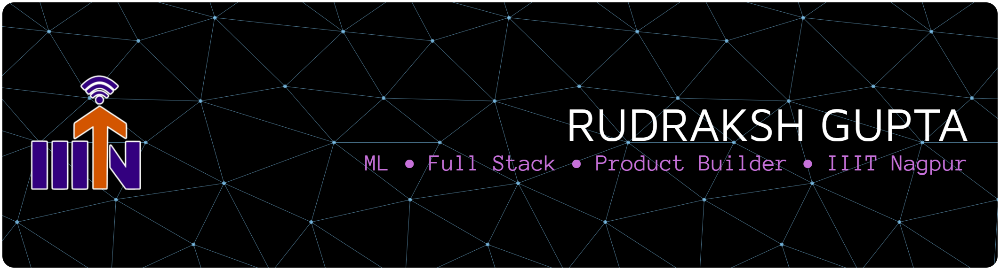
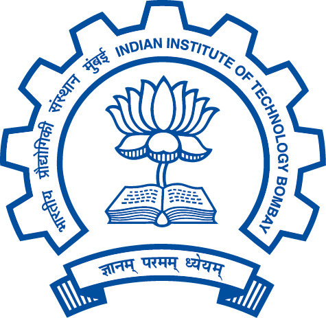
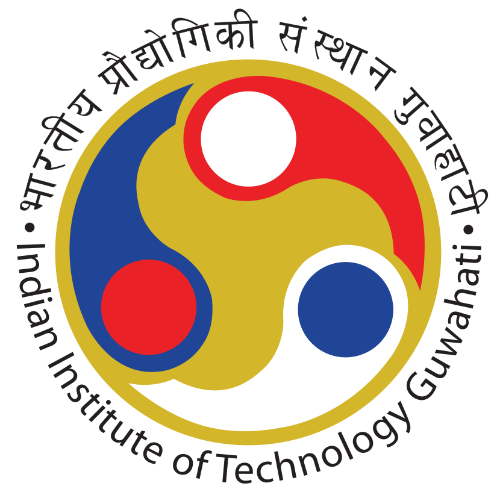
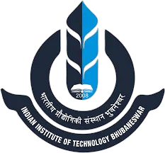
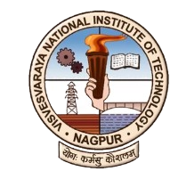
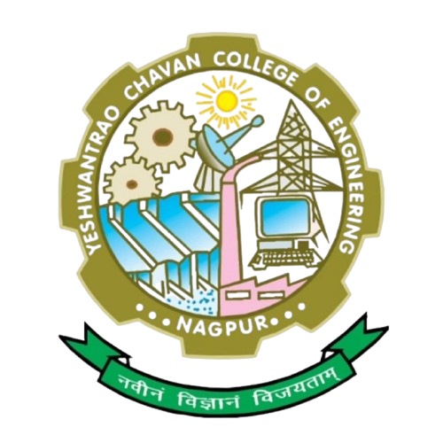

<!-- ========================= HERO ========================= -->

  

  <em>
    Building products that solve real-world problems through AI, software and design.
  </em>

 

 

 

---
<h2 align="center">

About Me

</h2>

<table>

<tr>

<td width="50%" valign="top">

### 👨‍💻 Developer

- 🤖 Exploring Machine Learning & AI
- 💻 Building Full Stack Applications
- 🚀 Love turning ideas into products
- 🌱 Learning Deep Learning & DSA

</td>

<td width="50%" valign="top">

### 🎯 Beyond Coding

- 🎓 B.Tech CSE @ IIIT Nagpur
- 🎤 Public Speaker & Debate Enthusiast
- 🏛 Organized Technical Events
- ☕ Powered by Curiosity

</td>

</tr>

</table>

------

<h2 align="center">

Technology Arsenal

</h2>

 

<h3 align="center">Languages</h3>

 

<h3 align="center">Frameworks & Libraries</h3>

 

<h3 align="center">Tools & Platforms</h3>

 

<h3 align="center">Other Tools</h3>

---<h2 align="center">

Competitive Programming

</h2>

 

------

<h2 align="center">

Journey Across Institutions

</h2>

 

&nbsp;&nbsp;&nbsp;&nbsp;

&nbsp;&nbsp;&nbsp;&nbsp;

&nbsp;&nbsp;&nbsp;&nbsp;

<b>IIIT Nagpur</b> •
<b>IIT Bombay</b> •
<b>IIT Guwahati</b> •
<b>IIT Bhubaneswar</b>

 

&nbsp;&nbsp;&nbsp;&nbsp;

&nbsp;&nbsp;&nbsp;&nbsp;

&nbsp;&nbsp;&nbsp;&nbsp;

<b>VNIT Nagpur</b> •
<b>YCCE</b> •
<b>RBU</b> •
<b>G H Raisoni</b>

---> Competitions, conferences, hackathons, workshops and academic experiences across India's leading institutions.

---

<h2 align="center">

GitHub Dashboard

</h2>

 

---<h2 align="center">

Contribution Activity

</h2>

---<h2 align="center">

Currently Focused On

</h2>

<table align="center">

<tr>

<td>

🤖 Machine Learning

</td>

<td>

█████████░░ 90%

</td>

</tr>

<tr>

<td>

💻 Full Stack Development

</td>

<td>

████████░░░ 80%

</td>

</tr>

<tr>

<td>

🧩 Data Structures & Algorithms

</td>

<td>

██████░░░░ 60%

</td>

</tr>

<tr>

<td>

🧠 Deep Learning

</td>

<td>

█████░░░░░ 50%

</td>

</tr>

</table>

---<h2 align="center">

Weekly Development Breakdown

</h2>

---<h2 align="center">

Contribution Snake

</h2>

Coming Soon 🐍

---

### Thanks for visiting my profile! ⭐

<i>"Stay curious. Keep building."</i>

