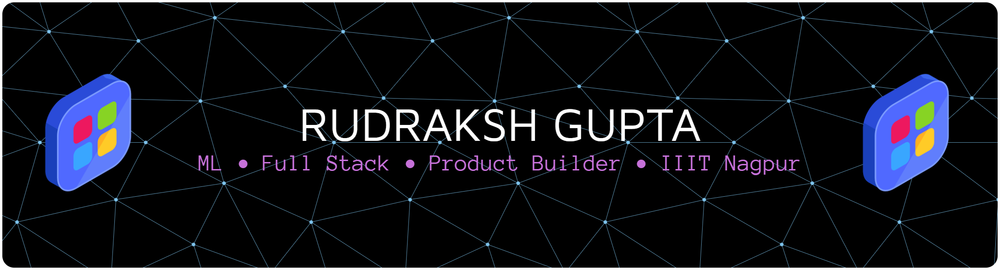

  <em>Building products that solve real-world problems through AI, software, and design.</em>

  

<h3>
About Me</h3>

<table>

<tr>
<td width="50%">

🧠 Interested in Machine Learning & AI

💻 Building Full Stack Applications

🚀 Love turning ideas into products

🌱 Currently exploring Deep Learning & DSA

</td>

<td width="50%">

🎓 B.Tech CSE @ IIIT Nagpur

🎤 Public Speaker & Debate Enthusiast

🏛 Organized technical & debating events

☕ Fueled by curiosity and coffee

</td>

</tr>

</table>

##  Tech Stack

🌱 Currently Working On

- 🤖 Machine Learning & Deep Learning
- 💻 Full Stack Development
- 🧩 Data Structures & Algorithms
- 🚀 Building impactful real-world projects
